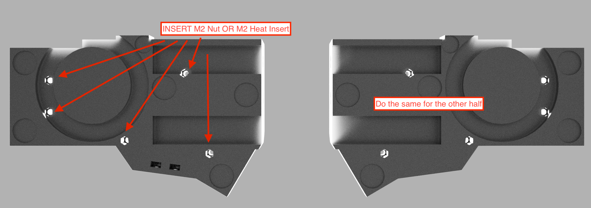
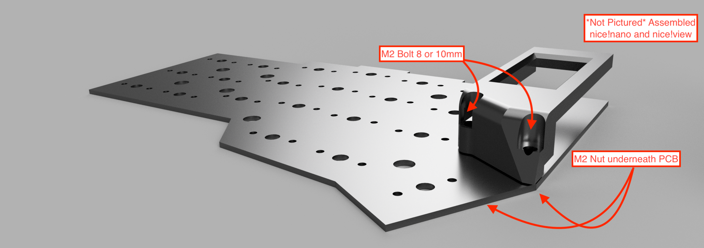
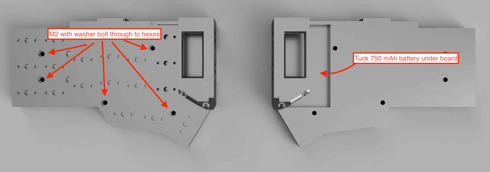
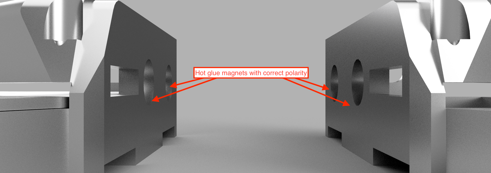
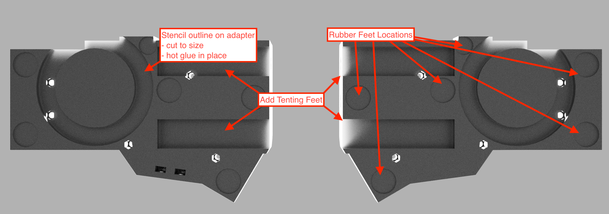
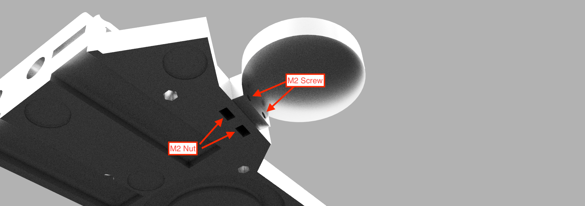
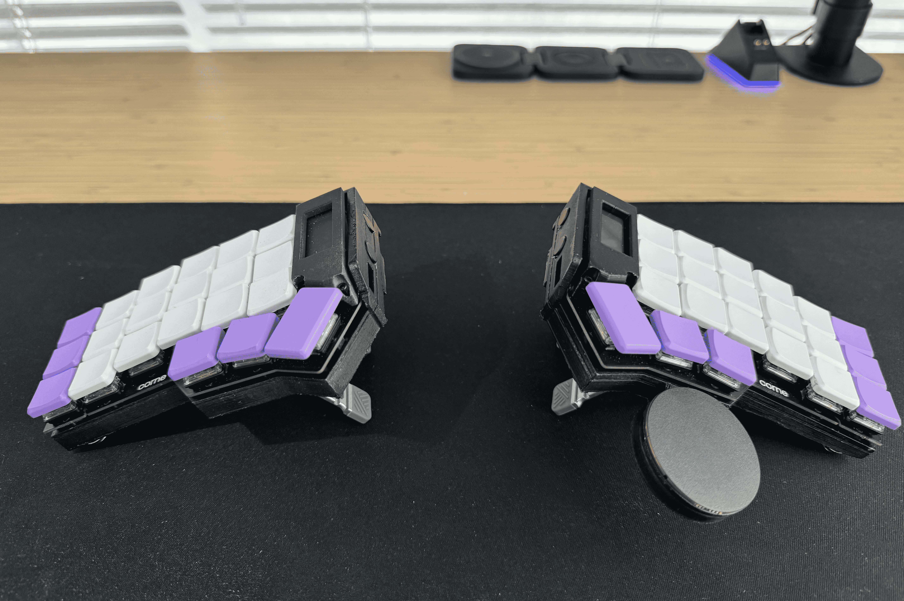
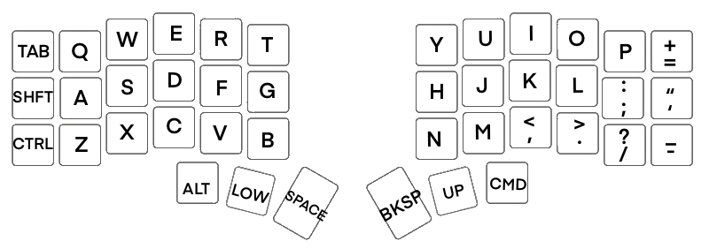
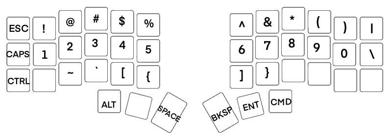
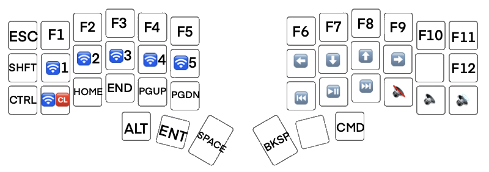

# dancard32/corne-config

<div align="center">

[](https://github.com/dancard32)
[](https://github.com/DanCard32/corne-config)
[](https://github.com/dancard32/corne-config)
[](https://github.com/DanCard32/corne-config/releases/)
[](https://github.com/dancard32/homelab/issues)

</div>


## Table of Contents

- [dancard32/corne-config](#dancard32corne-config)
  - [Table of Contents](#table-of-contents)
  - [Getting Started](#getting-started)
    - [Features](#features)
    - [Assembling the Corne Case](#assembling-the-corne-case)
    - [My Keycap Layout](#my-keycap-layout)
  - [Contributing](#contributing)
  - [License](#license)
  - [Acknowledgements](#acknowledgements)
  - [Contact or Support](#contact-or-support)

## Getting Started

There are four STL's to print (five if you are printing the trackpad) in the `stls` folder:

```bash
stls
├── BOT_TRACKPAD.stl
├── LEFT_BOTTOM_PLATE.stl
├── LEFT_VIEW.stl
├── RIGHT_BOTTOM_PLATE.stl
└── RIGHT_VIEW.stl
```

Recommended print settings:

- 50% infill
- 0.2mm layer height
- No support material (support is required for printing the trackpad)

The bill of materials are as follows:

- PCB board (left and right) - $35
- nice!nano v2.0 (x2) - $25/ea
- nice!view (x2) - $20/ea
- Tenting Feet (x4) - $15
- Lithium Battery 750mAh (x2) - $6/ea
- Kailh Low Profile Choc Switches (x42) - $5.50/10ea
- 8mm Magnets - $14
- M2 Screw set - $10
- MagSafe Adapter Ring - $10
- Keycap set - $30 (variable)

The majority of parts were source from [Typeractive](https://typeractive.xyz/), the remaining parts being [Cirque Trackpad 40mm](https://www.mouser.com/ProductDetail/Cirque/TM040040-2024-301?qs=sGAEpiMZZMu3sxpa5v1qrmePy6bg6o9mSWgtNQf0SXM%3D), [M2 Screw set](https://www.amazon.com/dp/B0B93G1H9L?ref=ppx_yo2ov_dt_b_fed_asin_title), [8mm x 3mm Magnets](https://www.amazon.com/dp/B0CSW7GQFB?ref=ppx_yo2ov_dt_b_fed_asin_title&th=1), [MagSafe Adapter Ring](https://www.amazon.com/dp/B09PG57NXN?ref=ppx_yo2ov_dt_b_fed_asin_title),

**Total Cost** ~ $230

### Features

This case is designed to have an extended battery, MagSafe adapter mounting, tenting feet and magnets to align the two halves of the case. This case still has some room for improvement such as some updates to the holes to the power and reset buttons, the side being thin, and aligning the view cases with the side etc. For now though I am happy with the results and may update this eventually as use cases change.

### Assembling the Corne Case

With the parts printed, use either M2 heat inserts or an M2 nut and a solder iron to place the nuts in place



**Note:** Make sure that you are able to thread into *all* the holes before final assembly

Next bolt the view cover in place



Now bolt the case to the PCB



Add the case magnets



Lastly add the mounting and feet



**Optional** Currently there is limited support for trackpad support, this case was designed in anticipation for trackpad support, but it is not currently implemented.



Flash the board using the generated assets in the pipeline build. An in-depth guide on how to do this can be found from Joe Scotto's [How to Build a Wireless Corne Keyboard](https://www.youtube.com/watch?v=FJgvi7WShxY&t=721s). If you want to reflash the board with an updated firmware double press the reset button and re-connect.

Add your switches and keycaps and there you go, your endgame Corne build is now complete!



Magnet Aligned Case


MagSafe mounting


### My Keycap Layout

Base Layer:



Low Layer:



Up Layer:



This is my personal keycap layout, feel free to use it as your own. I use a Windows laptop for work development and Macbook for personal work and schooling so I found this is a general good all purpose layout

## Contributing

Feel free to contribute to this project! Clone/Fork this repository and if you come across an issue feel free to open an issue (using the Bug or Feature request templates). If you have any changes and would like to merge into the main branch create a merge review and I will look over when I have time!

## License

No license, all of this is based upon open-source and as such this entire repository is available as well. I would like to keep this is open-source, I just wish for some acknowledgement if you ever use my designs and mappings :)

However, I would greatly appreciate it if you were to ...

[](https://www.buymeacoffee.com/dancard32)

## Acknowledgements

Show appreciation for and acknowledge the incredible help from the following community content creators:

- Josean Martinez - [YouTube](https://www.youtube.com/@joseanmartinez)
- Joe Scotto - [YouTube](https://www.youtube.com/@joe_scotto)
- ZMK Dev Team - [Github](https://github.com/zmkfirmware/zmk), [ZMK.dev](https://zmk.dev/)
- [r/crkbd](https://www.reddit.com/r/crkbd/)

## Contact or Support

If you are running into any issues first try forums to see if it is hardware specific - I doubt that I will enough time to directly respond to all invoices. If you are unable to pin-point an easy fix please open an issue as either a bug or feature for me to see. If it is security related, please email me at <dcard@umich.edu>
